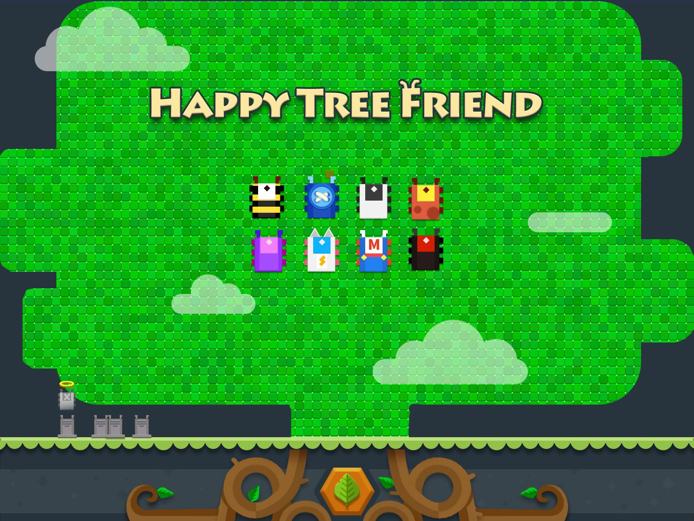

# HappyTreeFriends


## 游戏介绍

这是一款在 CiGA 2017 GameJam 厦门站开发的本地多人聚会游戏。CiGA 提交的游戏地址：http://wanga.me/CGJ2017/detail?game=69



这款游戏的玩法是由服务器运行游戏并显示在大屏幕上，玩家通过手机访问游戏 controller 页面，将手机浏览器变为 controller 并接入游戏，所有人一起在同一个大屏上进行游戏。每个玩家扮演一个虫子，通过啃食大树来获得分数，大树上会长出“技能果实”，虫子吃了果实可以随机获得技能，48小时内实现的技能包括：

1. 贪食技能：通过变大自己，来更快得啃食大树获取更多分数
2. 冲撞技能：自动加速，可以攻击其他玩家，被攻击的玩家将死亡，如果被攻击的玩家装备了其他技能，技能会被攻击者夺取
3. 炸弹技能：好像并不是什么好技能，因为吃到的话，在一定时限内会死亡，好在爆炸有一定的范围，可以在死亡时拉上几个垫背的

欢乐得撕逼吧～伙伴们


## 技术框架

1. 游戏框架 [Cocos Creator](http://www.cocos.com/creator)
2. 本地多人服务端框架 [HappyFunTimes](http://docs.happyfuntimes.net/)

## 制作组

程序：@pandamicro @Deniulor
策划：@Summer3205 @pandamicro @Deniulor
美术：小钊

## 文件说明

```
-assets/scripts/lib
    |-hft.js HappyFunTimes 客户端库
    |-sample-ui.js HappyFunTimes 界面相关，需要设为插件导入
-build/web-mobile Creator 构建目标，请勿更换构建目标路径
-build-templates/web-mobile/main.js 修改了资源索引的路径
-css/ HappyFunTimes 界面 css
-hft-sample-ui/ 使用这个文件夹覆盖到 node modules 目录下可以支持手机端的 360 度移动，否则只支持四向移动
-node_modules/ HappyFunTimes 服务端库和其他功能性模块
-scripts/controller.js 控制界面脚本
-controller.html 控制界面
-game.html 主界面
-main.js Electron 启动入口
-project.json 模块信息，启动命令
```

## 使用流程

1. 安装 [nodejs](https://nodejs.org/)
2. 在项目根目录下执行 `npm install`
3. `npm start` 运行 electron 并启动主游戏界面
4. 保证手机与运行游戏的 PC 处于同一个 wifi 下
4. 在手机端用浏览器访问 `happyfuntimes.net`

## 开发流程

1. 用 [Cocos Creator](http://www.cocos.com/creator) 打开项目根目录
2. 从菜单找到"项目" > "构建发布"，并构建到 `build/web-mobile`
3. 按照使用流程运行服务端即可显示最新的游戏版本